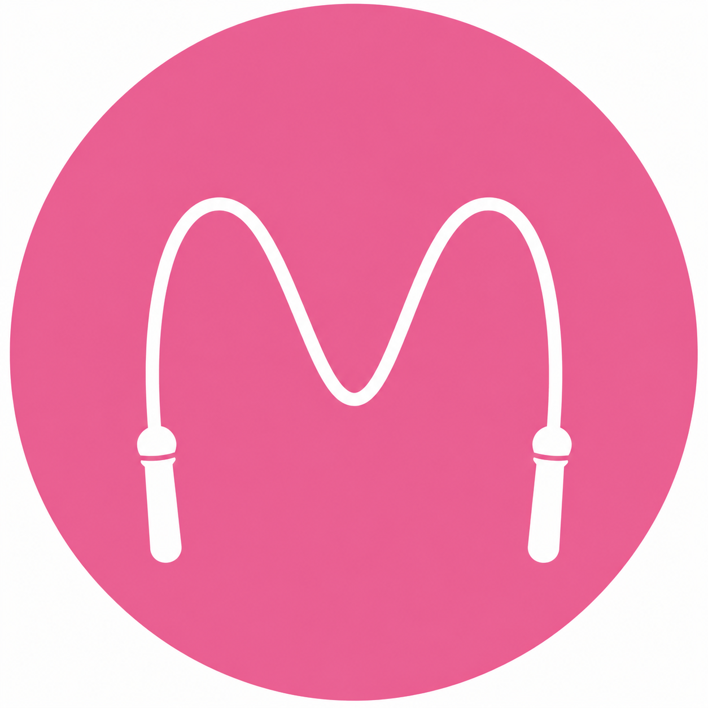

# Логотип и favicon

Добавлено:

- `assets/mama-logo-rope.png` - логотип для шапки;
- `assets/favicon.png` - favicon и apple-touch-icon.

В HTML старый зелёный кружок заменён на:

```html

```

Для страниц внутри `/digests/...` путь автоматически заменён на:

```html

```
